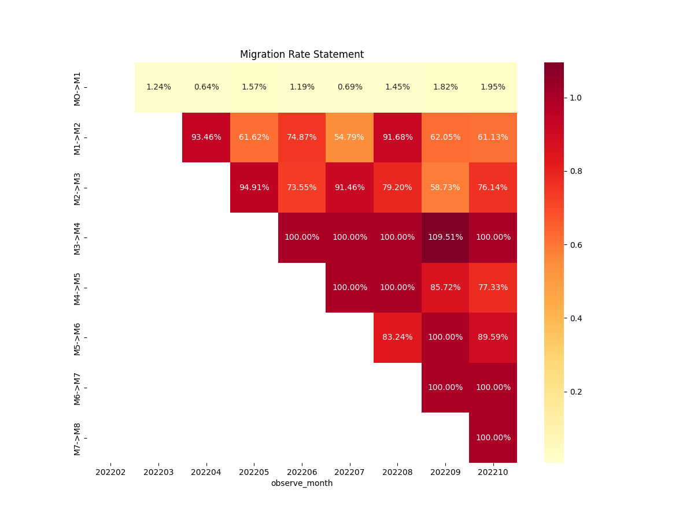

# 还款行为与迁移率分析 
**日期**：2025年5月25日  
**作者**：胡云皓  

## 目录  
1. **项目背景**  
2. **数据概况**  
3. **分析方法**  
4. **关键结果**  
5. **可视化展示**  
6. **结论与建议**

## 1. 项目背景  
本报告旨在分析**贷款订单的还款行为**，通过对比计划还款与实际还款数据，识别逾期风险并计算迁移率，追踪贷款账户在不同逾期状态间的动态变化，为风险管理与催收策略提供数据支持。  

**核心目标**：  
- 识别逾期订单的分布特征  
- 量化不同逾期状态的迁移率  

## 2. 数据概况  
### 数据来源  
| 数据集 | 描述 | 关键字段 |  
|--|--| -- |
| `repay_actual`   | 实际还款记录             | `order_id`, `actual_repay_date`, `actual_repay_prin` |  
| `repay_plan`     | 计划还款记录             | `order_id`, `expected_date`, `loan_amt` |  

### 数据规模  
| 指标               | 实际还款表   | 计划还款表   |  
|-- | -- | -- |  
| 总记录数           | 22,112       | 21,571    |  
| 唯一订单数         | 5,031      | 5,008       | 

## 3. 分析方法  
### 数据处理流程  
1. **数据清洗**  
   - 筛选快照日期（2022-12-14）  
   - 检测并剔除异常值（负利率、零还款本金）  
2. **数据合并**  
   - 左连接（`order_id` + `order_sub_id`）  
   - 保留应还款日在快照日期前的记录  
3. **逾期分类逻辑**  
   - **逾期标识**：`observe_flag`（0=按时还款，1=逾期）  
   - **逾期类型**：  
     - `0`: 良好  
     - `1`: 初犯（本期首次逾期）  
     - `2`: 再犯（连续逾期）  
4. **迁移率计算**  
   - 公式：
     迁移率 = 下一期逾期余额/本期逾期余额

## 4. 关键结果  
### 逾期状态分布  
观测2022年2月开始放款以来年内的逾期期数可得下表
| 逾期期数 | 占比   | 描述               |  
|-|--|--|  
| M0       | 96.97%    | 按时还款           |  
| M1       | 1.30%    | 逾期1-30天         |  
| M2       | 0.59%     | 逾期31-60天        |  
| M3+      | 1.14%     | 逾期超过60天       |  

### 迁移率示例
2022年2月份的放款单在前三个月的迁移率如下
| 迁移路径  | 迁移率 |  
|--|--|  
| M0 → M1   | 1.24%   |  
| M1 → M2   | 93.46%  |  
| M2 → M3   | 94.91%  |  

## 5. 可视化展示

  
**迁移率热力图**:
- **迁移路径**：如 `M1 > M2` 表示从逾期1-30天（M1）恶化到逾期31-60天（M2）的逾期金额比例。  
- **观察列**：每个斜向路径下的百分比对应同一放款月份不同观测月份下的迁移率（如 `202202` 代表2022年2月）。  
- **观察月份**：底部标签 `202202` 至 `202210` 表示观察月份覆盖2022年2月至10月。

## 6. 结论与建议 
1. **关键迁移路径分析**
   1. **高风险路径**  
    - **M1 → M2**：  
      - 迁移率分布在 54.79%~93.46%之间， 平均为65.21%。  
      - **结论**：大部分M1逾期账户会在下个月恶化至M2，需优先加强M1阶段的催收。  

   - **M2 → M3**：  
     - 迁移率分布在58.79%~94.91%，平均为 71.44%。  
     - **结论**：M2账户进一步恶化的风险相较M1逾期账户更高，需采取更强硬措施。  

2. **极端风险路径**  
   - **M4 → M5、M6 → M7、M7 → M8**：  
     - 迁移率均接近 100%。  
     - **结论**：一旦进入M4及以上逾期阶段，账户几乎无法回收，需考虑核销坏账。  

3. **时间趋势观察**
   - **M1 → M2 迁移率波动**：  
     - 2022年2月到2022年9月，整体呈下降趋势。  
     - **可能原因**：催收策略或面向客群优化，外部经济环境改善。  

4. **客群趋势观察**
   - **放款月后续迁移率**：
     - 2022年2月与2022年4月的放款相较于其他月份有更高的坏账进一步恶化风险
     - **可能原因**：活动拉新引进高风险客户

5. **行动建议**
   - **优先级排序**：重点监控 **M1→M2** 和 **M2→M3** 高迁移率阶段，优化催收资源分配。  
   - **坏账管理**：对 **M3+** 逾期账户启动核销程序，减少资源浪费。
   - **趋势跟踪**：按月生成迁移率报告，识别外部因素（如政策、经济）对逾期行为的影响。  

