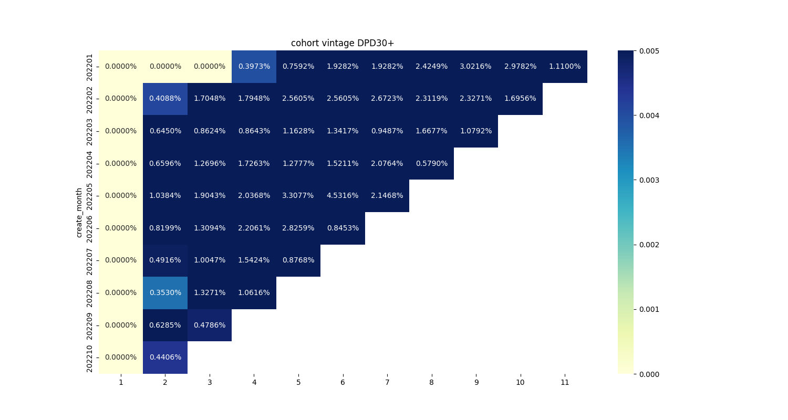
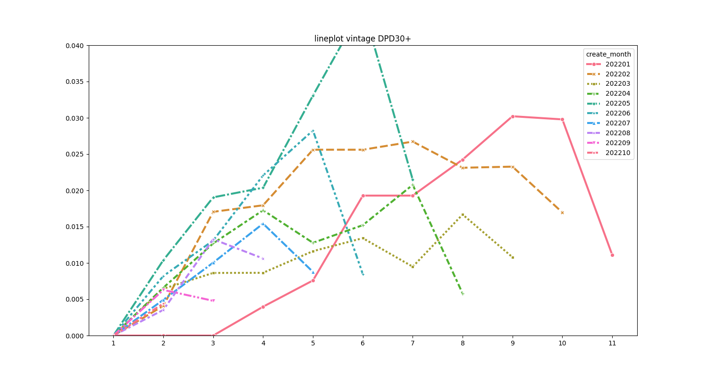

# Vintage分析报告
## 一、分析背景
本报告基于消费金融业务中的实际还款数据与计划还款数据,生成Vintage报表，通过Cohort分析方法评估不同放款月份资产质量，监测DPD30+（逾期30天以上）风险趋势。
## 二、分析方法
1. 数据处理流程

> ### 核心处理流程
> 1. 数据加载：读取实际还款表(repay_actual_data_new.csv)和计划还款表(repay_plan_data_new.csv)
>2. 快照筛选：选择2022-12-31数据快照
>3. 表关联：通过借款单id和应还款单id关联实际还款与计划还款数据
>4. 逾期计算：
>   - 计算每期剩余本金(balance)
>   - 根据还款日期生成逾期标识(overdue_flag)
>   - 区分首次逾期、连续逾期等场景(overdue_type)
>5. 坏账定义：逾期超过30天的未偿本金记为风险敞口

2. 关键指标计算
> ### Vintage计算逻辑
> vintage_rate = SUM(逾期30+未还本金) / 放款月份总本金

## 三、分析结果
1. Vintage热力图分析

核心发现：

- 风险集中期：2022年5月放款群组(MOB5)逾期率达到峰值4.53%
- 风险人群：2022年7月后放款群组逾期率显著下降至0.87%以下
- 账期规律：所有群组在MOB6后风险趋于稳定

2. Vintage曲线趋势

趋势解读：
- 早期风险暴露：2022年1-4月放款群组呈现明显风险上升趋势
- 政策改进效果：2022年5月起放款群组曲线趋于平缓
- 最长账期表现：MOB12最长观察期逾期率稳定在2.67%以下"

## 四、关键结论
1. 风险识别
- 2022年Q1放款资产存在较高风险敞口
- MOB3-6为关键风险暴露期，需加强贷中监控

2. 策略建议
   1. **风控优化**：
      - 对MOB3-6阶段逾期客户增加还款提醒频率
      - 优化2022Q1相似客群的准入规则
   2. **拨备计提**：
      - 对2022年4月放款群组增加5%特别拨备"

 
